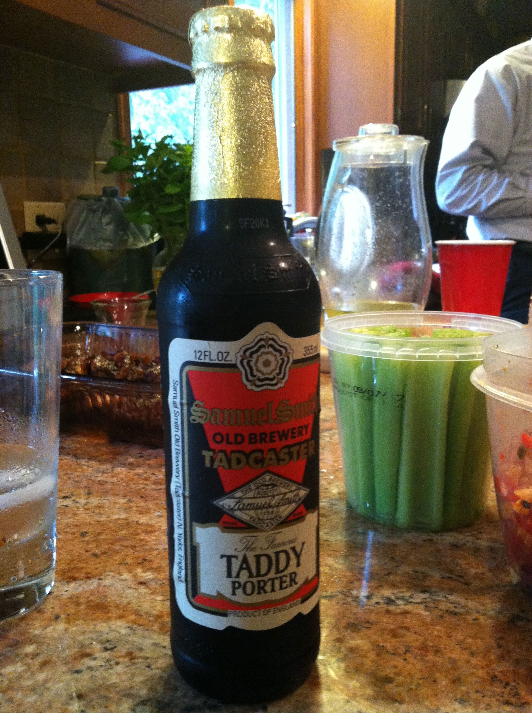

**Date:** Sunday, September 2, 2012

**Participants (7):** Aly, Andy, Bruce, Chris, Dean, Frank, Jeff

**Candidates (1):** Justin ([Porter Presentation](./assets/porter.pdf))

**Resources:** [Beer Infographic](http://sposetti.github.io/East-Greenville/images/beer-infographic.jpg),
[Porter Beer - Wikipedia](http://en.wikipedia.org/wiki/Porter_beer)

| Beer Name  | Score (Rank) | Aly | Andy | Bruce | Chris | Dean | Frank | Jeff |
|---|---|---|---|---|---|---|---|---|
|  Saranac High Peaks Chocolate Orange (Aly) | 27 - #1 | 4 | 3 | 4 | 4 | 4 | 4 | 4 |
|  Stone Smoked Porter w/Vanilla Bean (Andy) | 23.5 - #2 | 5 | 5 | 3 | 3 | 2 | 3 | 2.5 |
|  Fuller's London Porter (Bruce) | 21.5 - #3 | 3 | 4.5 | 1 | 3.5 | 3 | 3 | 3.5 |
|  Deschutes Black Butte (Jeff) | 17.5 - #4 | 1 | 3.5 | 1 | 3 | 3 | 3 | 3 |
|  Otter Creek Stovepipe Porter (Dean) | 15.5 - #5 | 1.5 | 1 | 2 | 3 | 2 | 2 | 4 |
|  Sam Smith Taddy Porter (Chris) | 14 - #T6 | 1 | 2 | 2 | 4 | 1 | 2 | 3 |
|  Crown Valley Brewing Plowboy Porter (Frank) | 14 - #T6 | 2 | 4 | 1 | 1 | 3 | 1 | 2 |
