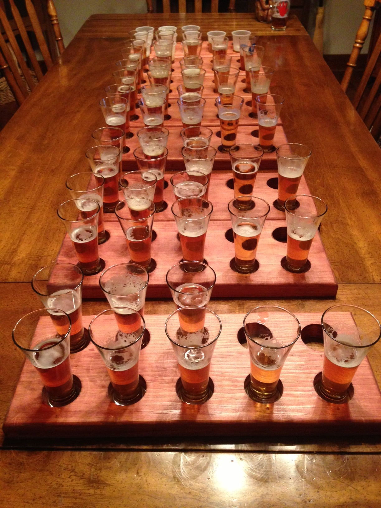
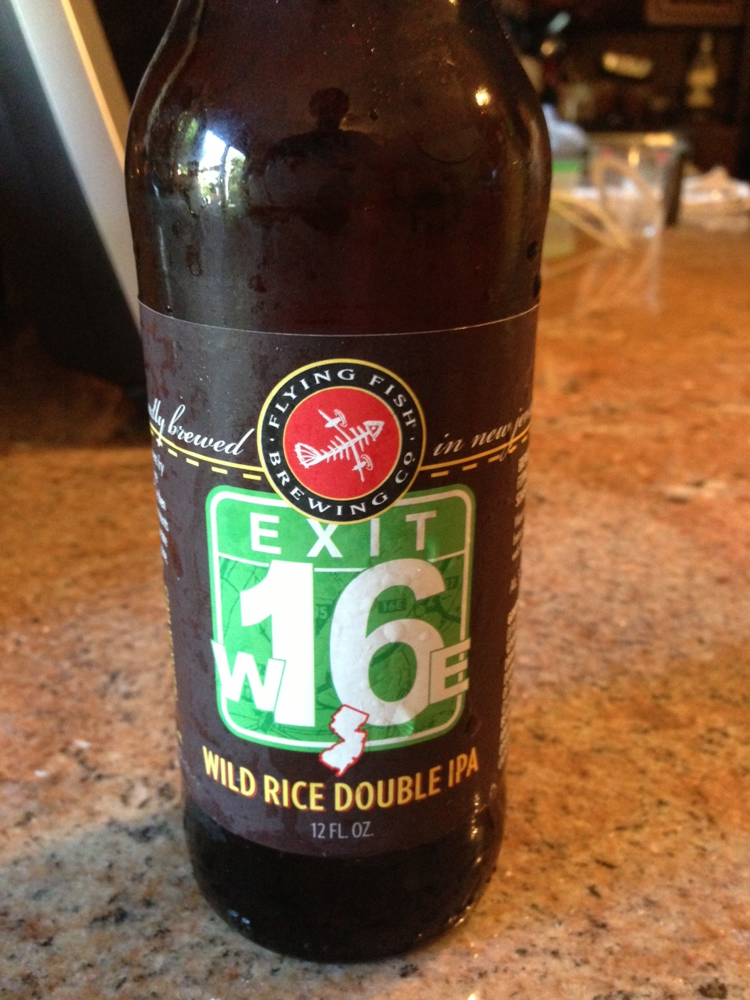
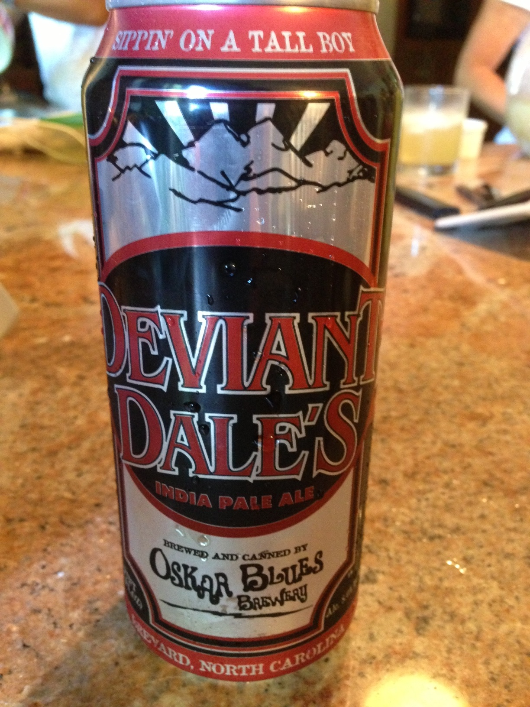
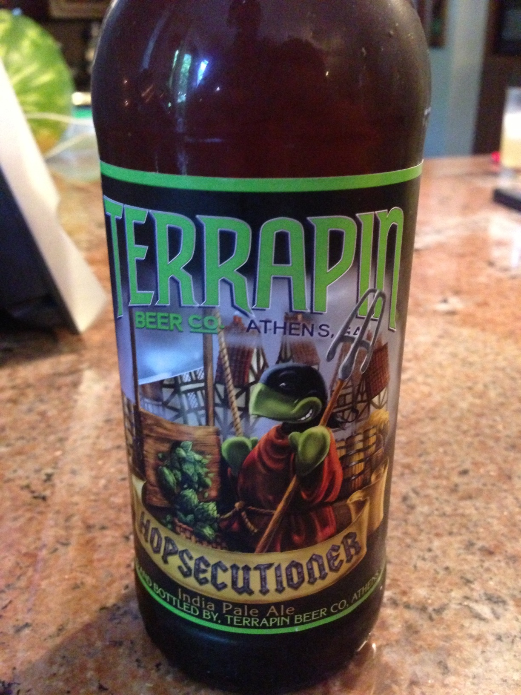
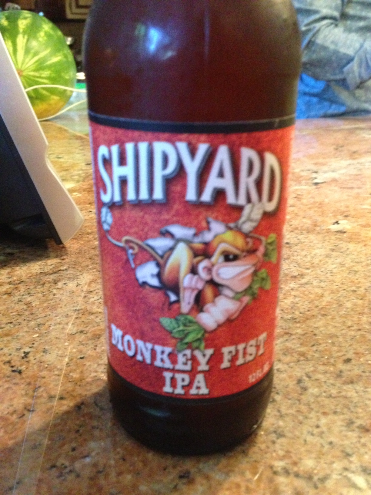
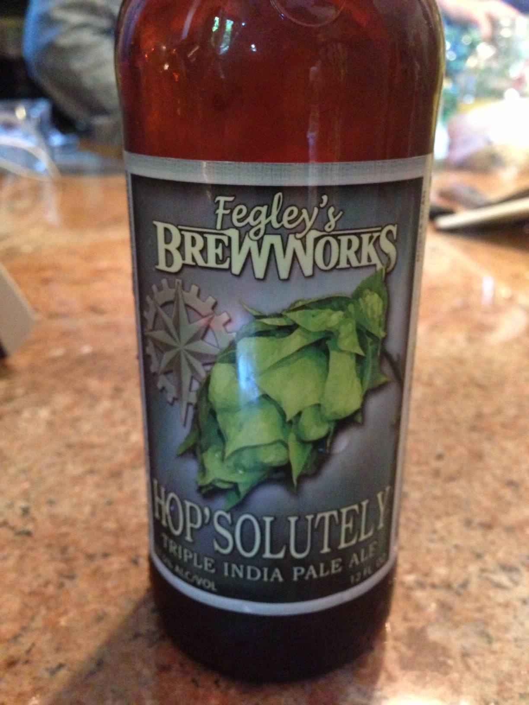
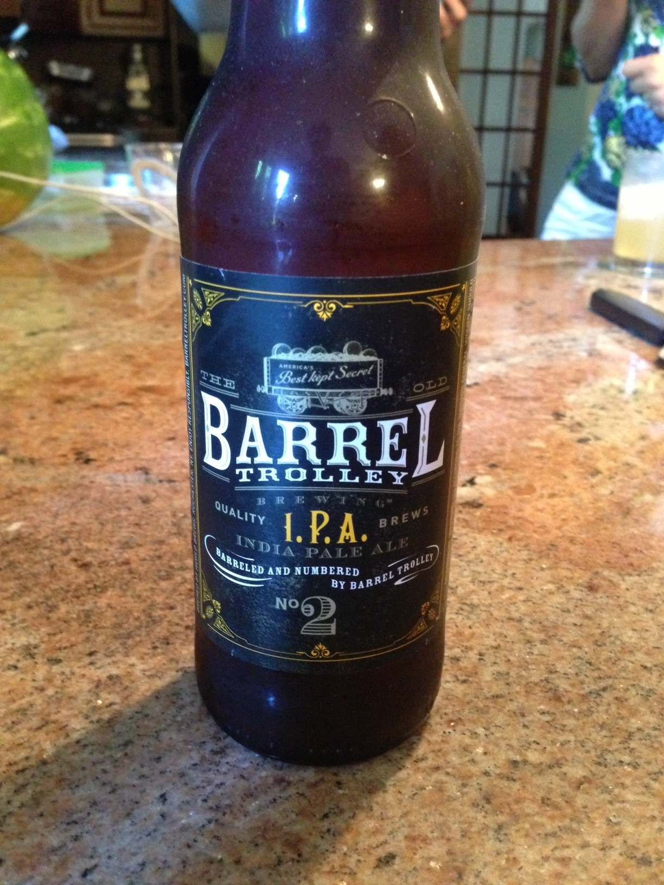
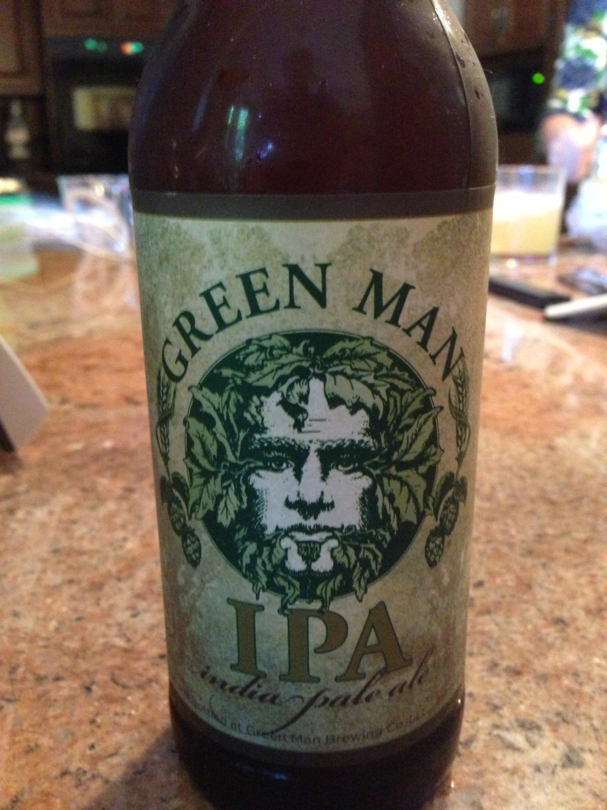

**Date:** Saturday, August 24, 2013

**Participants (8):** Aly, Andy, Bruce, Chris, Dean, Frank, Jeff, Justin 

| Beer Name  | Score (Rank) | Aly | Andy | Bruce | Chris | Dean | Frank | Jeff | Justin |
|---|---|---|---|---|---|---|---|---|---|
|  Flying Fish Exit 16 (Andy) | 31.5 - #1 | 5 | 5 | 5 | 3 | 5 | 1 | 3.5 | 3 |
|  Three Heads Brewing - The Kind (Chris) | 24.5 - #2 | 4.5 | 4 | 2 | 3 | 4 | 3 | 3 | 1 |
|  Oskar Blues- Deviant Dale's IPA (Aly) | 23.5 - #3 | 3.5 | 4 | 3 | 3.5 | 5 | 1 | 2.5 | 1 |
|  Terrapin - Hopsecutioner (Jeff) | 21.5 - #4 | 4 | 3 | 2 | 3 | 4 | 2 | 1.5 | 2 |
|  Shipyard - Monkey Fist IPA (Bruce) | 21.0 - #5 | 1.5 | 4.5 | 1 | 3 | 3 | 2 | 3 | 3 |
|  Fegley's BrewWorks - Hop'solutely (Justin) | 19.5 - #6 | 2 | 1 | 4 | 5 | 1 | 1 | 2.5 | 3 |
|  Barrel Trolley - IPA (Frank) | 19 - #T7 | 2 | 3 | 2 | 4 | 3 | 1 | 3 | 1 |
|  Green Man - IPA (Dean) | 19 - #T7 | 3 | 1 | 1 | 3 | 3 | 3 | 3 | 2 |
