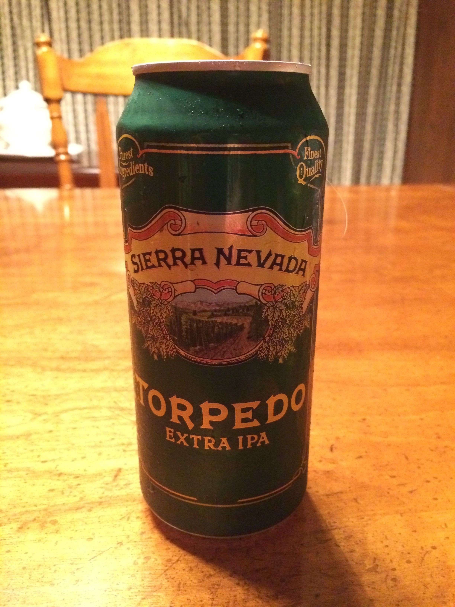

**Date:** Sunday, August 31, 2014

**Participants (9):** Aly, Andy, Bruce, Chris, Dean, Frank, JeffK, JeffS, Justin 

| Beer Name  | Score (Rank) | Aly | Andy | Bruce | Chris | Dean | Frank | JeffK | JeffS | Justin |
|---|---|---|---|---|---|---|---|---|---|---|
|  North Country Brewing - Buck Snort Stoudt (Justin) | 36.5 - #1 | 4 | 5 | 4.5 | 3 | 3 | 4 | 4 | 4 | 5 |
|  Sierra Nevada - Torpedo (Bruce) | 36.0 - #2 | 5 | 5 | 4.5 | 4.5 | 2 | 3 | 3 | 4 | 5 |
|  Oskar Blues - Dale's Pale Ale (Aly) | 35.5 - #3 | 5 | 4 | 2 | 4.5 | 3 | 3 | 4 | 4 | 5 |
|  Sly Fox - 113 IPA (Andy) | 28.5 - #4 | 3 | 2 | 3 | 4 | 2 | 2 | 5 | 3.5 | 4 |
|  Stillwater Artisanal - Classique (Dean) | 27.0 - #5 | 2 | 3 | 3 | 4 | 4 | 5 | 1 | 3 | 2 |
|  Sly Fox - Grisette (Chris) | 25.5 - #6T | 4 | 2 | 4.5 | 3 | 3 | 3 | 2 | 2 | 2 |
|  Schlafly - American Brown Ale (Frank) | 25.5 - #6T | 1 | 4 | 3 | 3 | 4 | 3 | 1 | 3.5 | 3 |
|  DC Brau - The Citizen (JeffS) | 24.0 - #8 | 2.5 | 4 | 2 | 3 | 4 | 1 | 3 | 2.5 | 2 |
|  Sly Fox - Octoberfest (JeffK) | 18.5 - #9 | 2 | 2 | 2 | 2 | 2 | 2 | 2 | 2.5 | 2 |