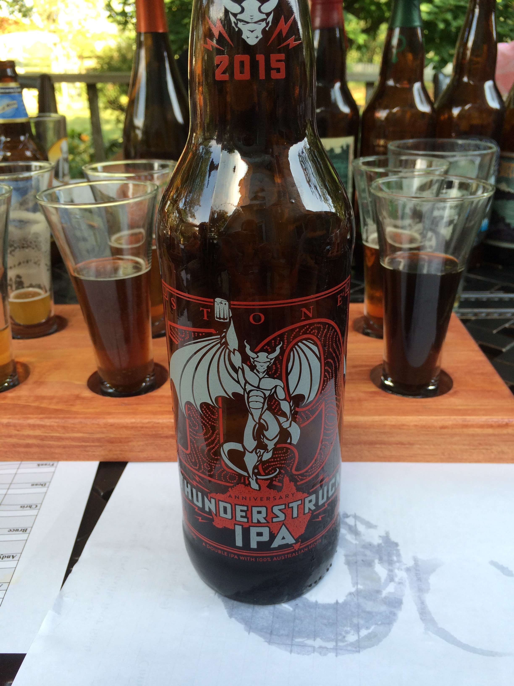
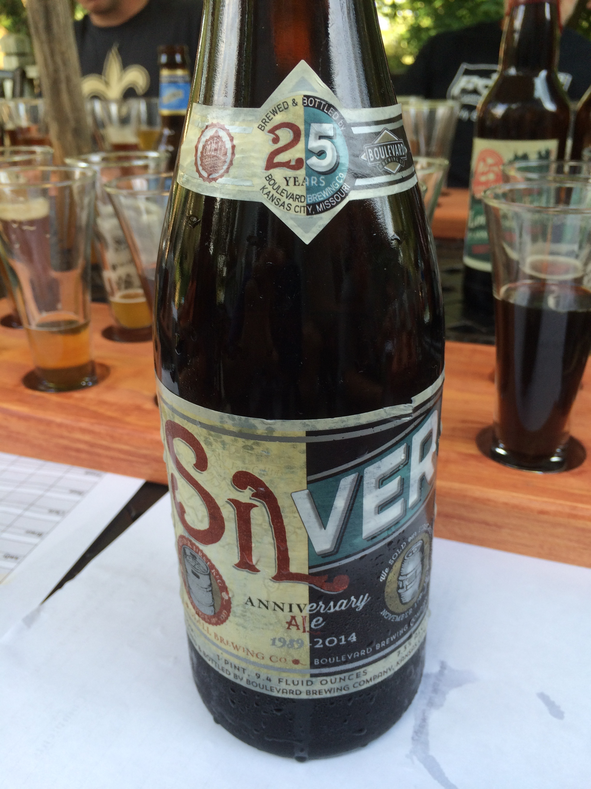
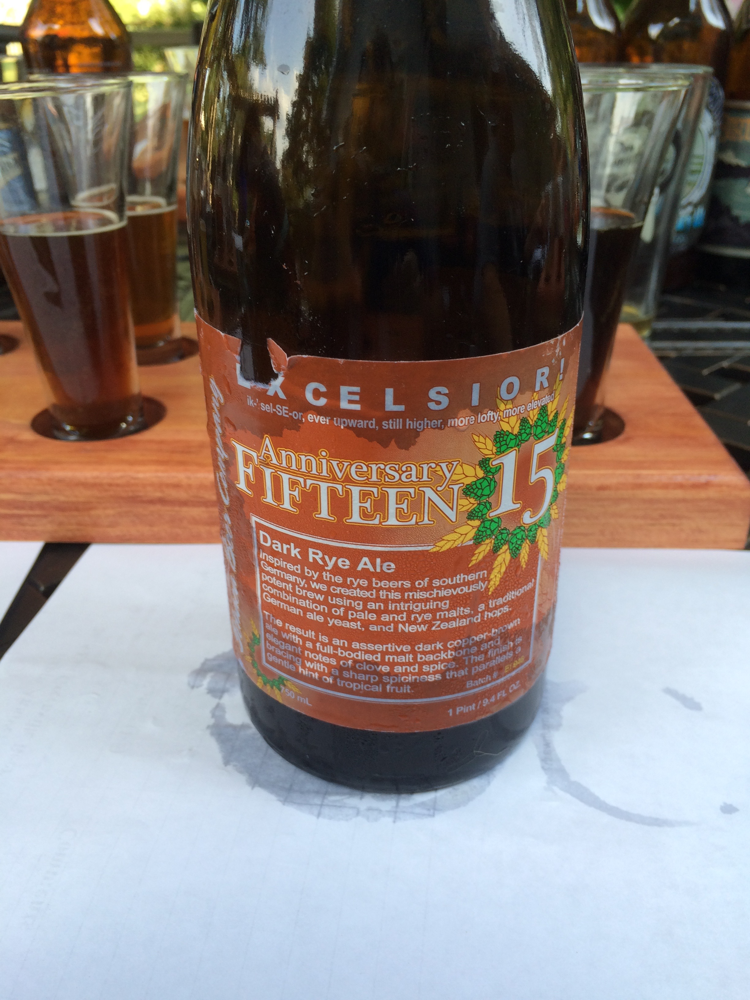
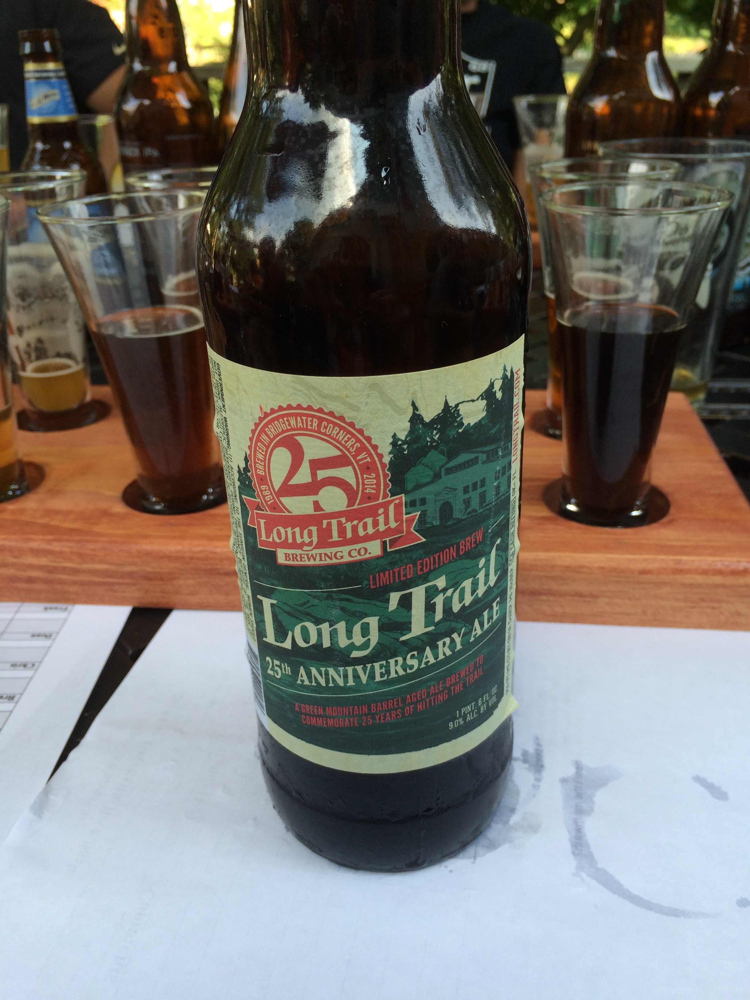
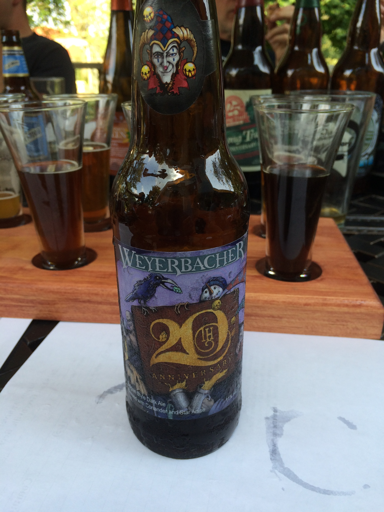
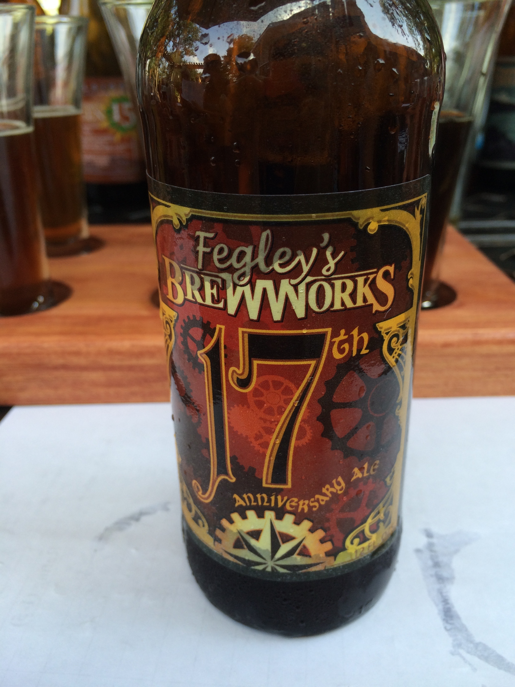
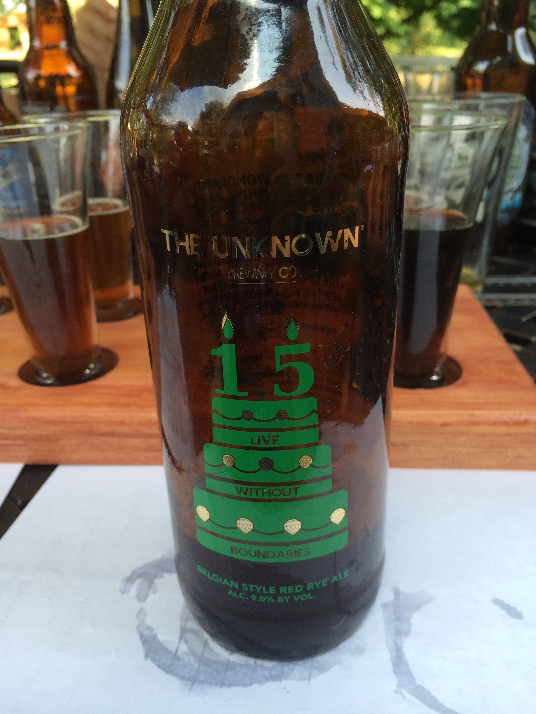

**Date:** Saturday, August 29, 2015

**Participants (9):** Aly, Andy, Bruce, Dean, Chris (Rachel), Frank, JeffK, JeffS, Justin 

| Beer Name  | Score (Rank) | Aly | Andy | Bruce | Chris | Dean | Frank | JeffK | JeffS | Justin |
|---|---|---|---|---|---|---|---|---|---|---|
|  Stone Brewing Co - Thunderstruck IPA (JeffK) | 34.5 - #1 | 5 | 5 | 4.5 | 4 | 4 | 0 | 4 | 4 | 4 |
|  Port Brewing - Anniversary Ale Imperial IPA (Justin)  | 25.0 - #2 | 2 | 1 | 4.5 | 4 | 0 | 0 | 5 | 3.5 | 5 |
|  Blue Moon - Belgian White (Nobody) | 24.0 - #3 | 1 | 4 | 2 | 3 | 3 | 5 | 5 | 0 | 1 |
|  Boulevard - Silver Anniversary Ale (Bruce) | 20.0 - #4 | 1 | 1 | 4 | 2 | 4 | 3 | 3 | 2 | 0 |
|  Ithaca - Excelsior! 15th Anniversary Dark Rye (Frank) | 17.5 - #5 | 2 | 1 | 3 | 3 | 3 | 1 | 2 | 2.5 | 0 |
|  Long Trail - 25th Anniversary Ale (Jeff) | 17.0 - #6 | 1 | 0 | 3 | 5 | 0 | 2 | 2 | 1 | 3 |
|  Weyerbacher Brewing Co. - 20th Anniversary Ale (Andy) | 16.0 - #7 | 3 | 1 | 3 | 3 | 0 | 1 | 1 | 2 | 2 |
|  Fegley's Brew Works - 17th Anniversary (Chris) | 15.0 - #8 | 2 | 0 | 3 | 3 | 0 | 2 | 3 | 2 | 0 |
|  Uinta Brewing Company - 22nd Crooked Line Birthday Suit: Sour Plum Abbey Ale (Aly) | 11.0 - #9 | 3 | 4 | 1 | 0 | 0 | -1 | 4 | 0 | 0 |
|  The Unknown Brewing Company - 1.5ish Anniversary (Dean) | 5.0 - #10 | 0 | 1 | 1 | 3 | 0 | -1 | 1 | 0 | 0 |