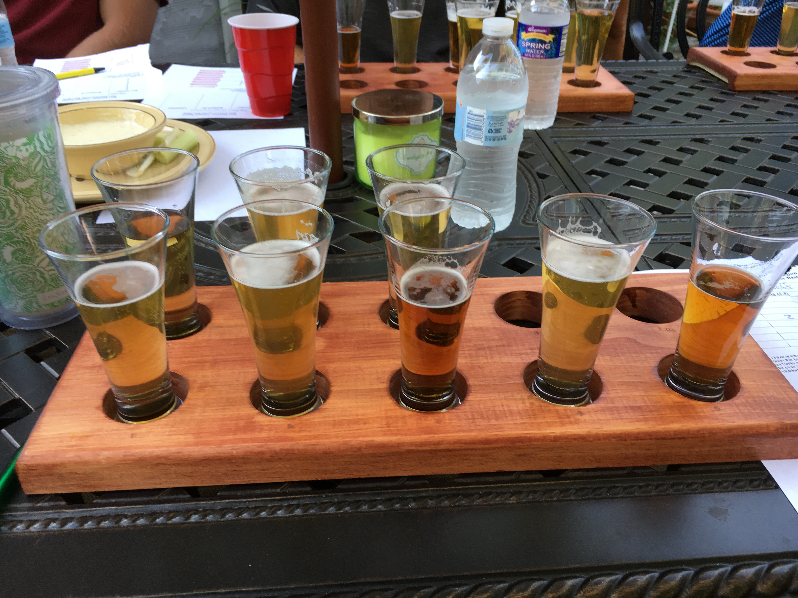
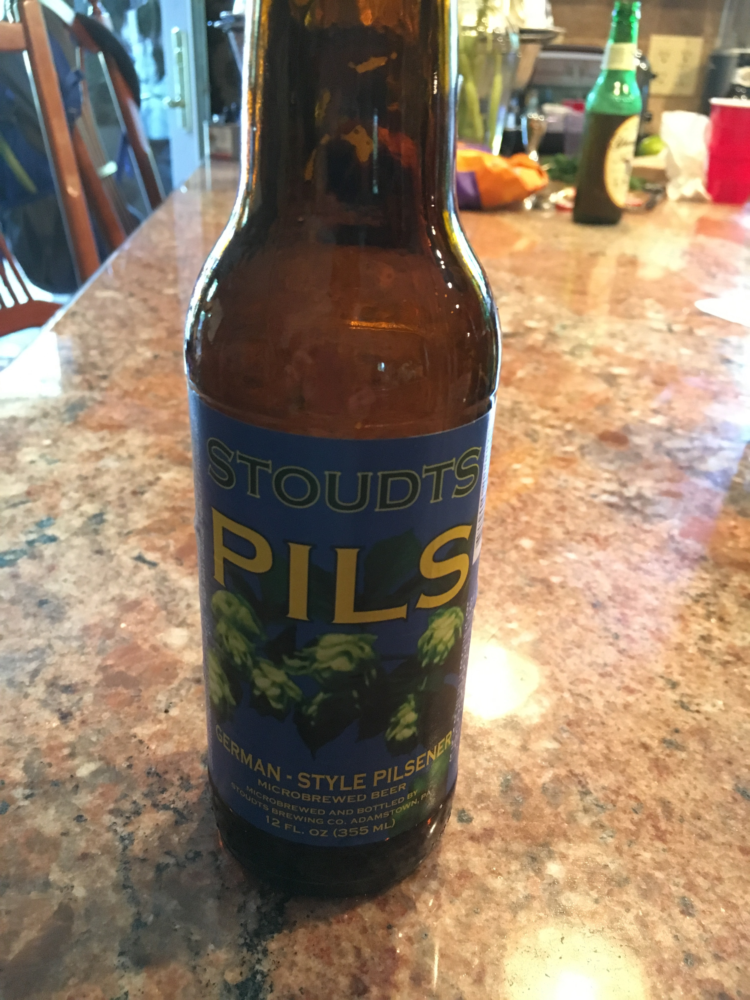
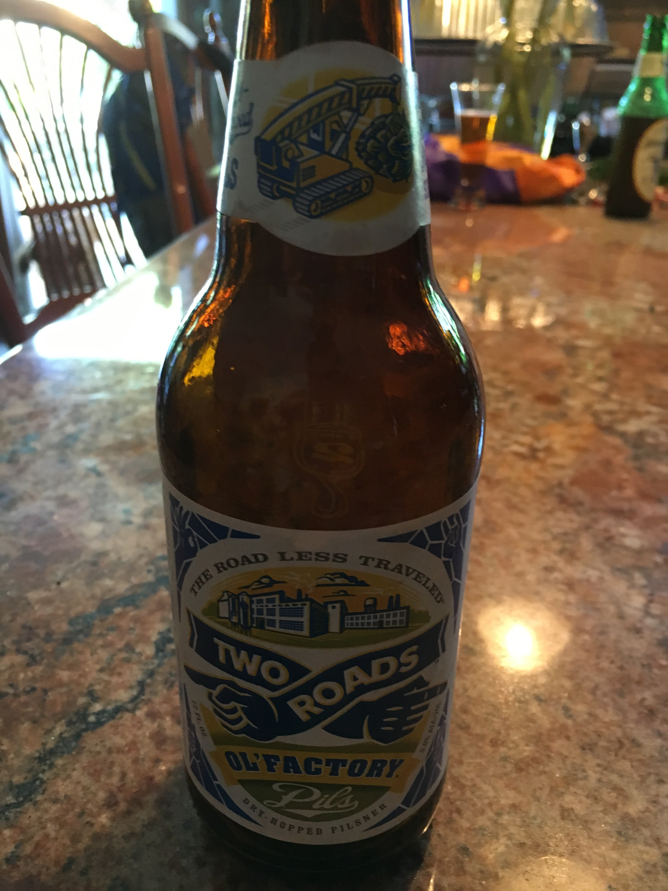
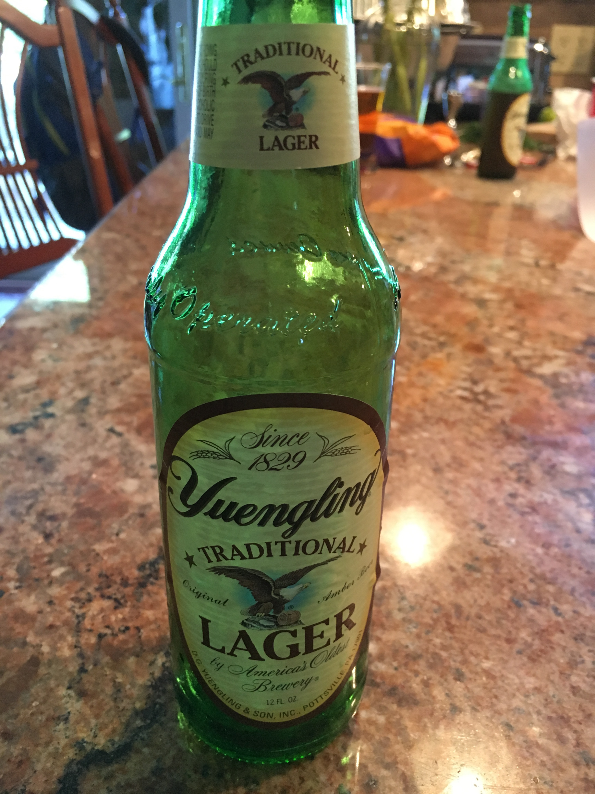
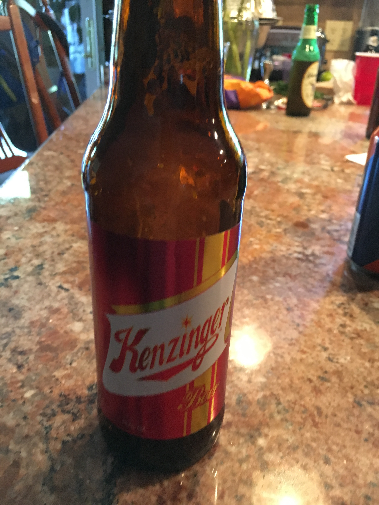
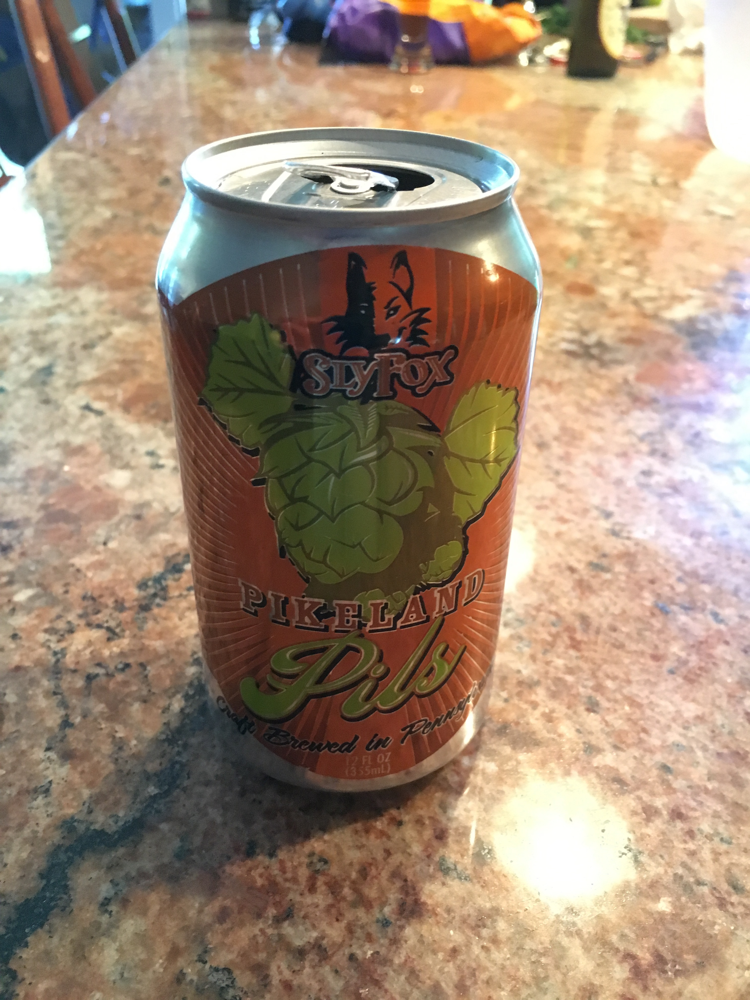
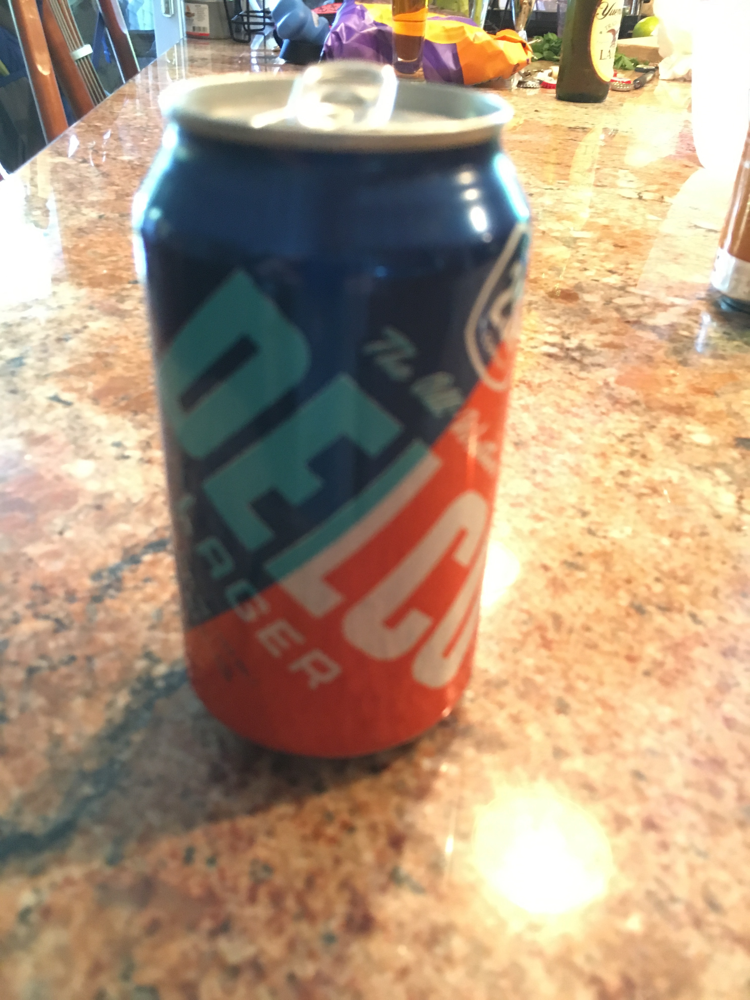
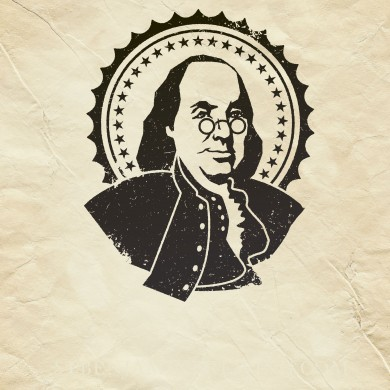
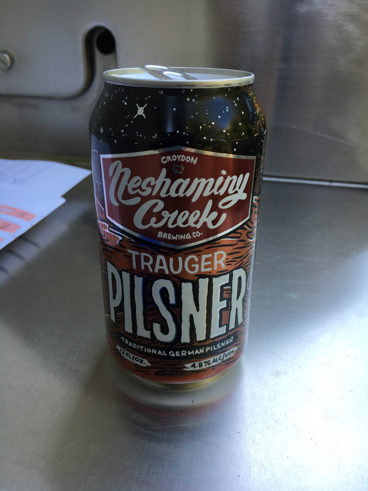

**Date:** Sunday, September 4, 2016

**Weather:** 81°, Clear, No Rain

**Participants (8):** Andy, Bruce, Chris, Frank, G-Mom + Rachel, JeffK, JeffS, Justin

[2016 Beer Madness Bracket](./images/2016/beer-madness-2016.jpg)

| Beer Name  | Score (Rank) | Andy | Bruce | Chris | Frank | G-Mom Rachel | JeffK | JeffS | Justin |
|---|---|---|---|---|---|---|---|---|---|---|
|  Stoudt's - Pils (Justin) | 25.5 - #1 | 3 | 3 | 2.5 | 3 | 2 | 5 | 2 | 5 |
|  Two Roads - Ol'Factory Pils (Frank) | 25.0 - #2 | 3 | 2 | 3.5 | 2 | 3 | 5 | 2.5 | 4 |
|  Yuengling - Lager (JeffS) | 23.5 - #3 | 1 | 2 | 3.5 | 5 | 4 | 2 | 2 | 4 |
|  Philadelphia Brewing Co. - Kenzinger (JeffK) | 23.0 - #4 | 2 | 4 | 3 | 4 | 1 | 4 | 2 | 	3
|  Sly Fox - Pikeland Pils (Dean) | 22.0 - #5 | 1 | 3 | 3 | 4 | 3 | 3 | 2 | 3 |
|  2SP - Delco Lager (Bruce) | 21.0 - #6 | 1 | 2 | 3 | 3 | 5 | 2 | 1 | 4 |
|  Saint Benjamin - Junto (Chris) | 19.5 - #7 | 0 | 3 | 2 | 4 | 4 | 2 | 1.5 | 3 |
|  Neshaminy Creek - Trauger Pils (Andy) | 16.0 - #8 | 2 | 2 | 2 | 2 | 2 | 1 | 2 | 3 |
