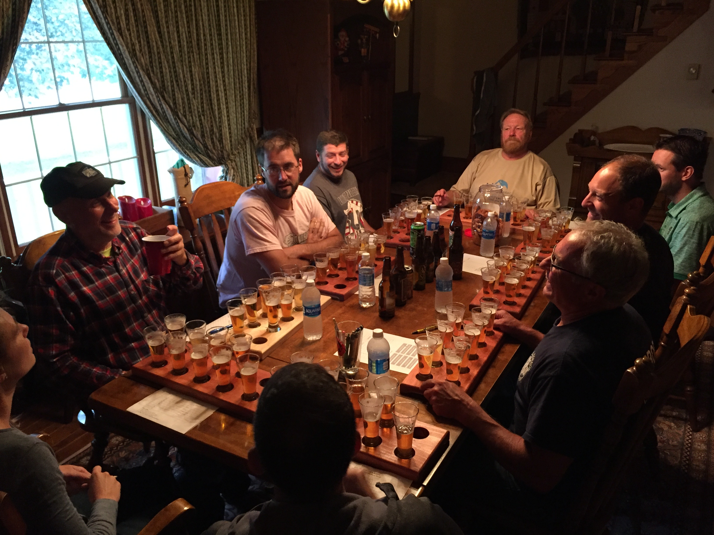
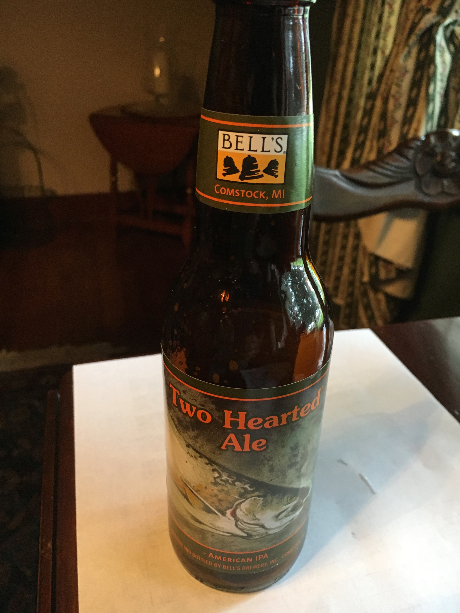
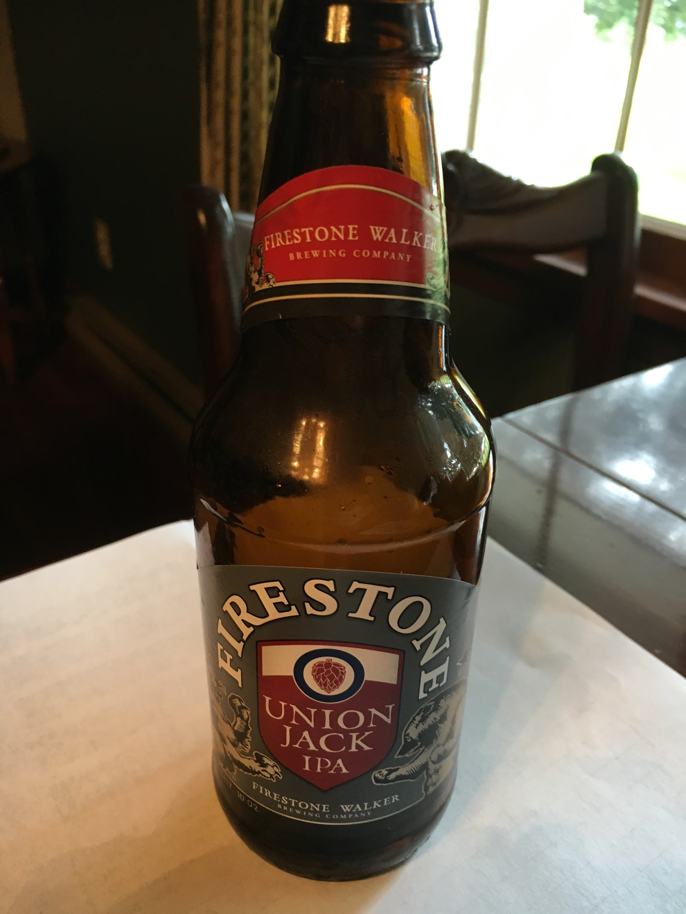
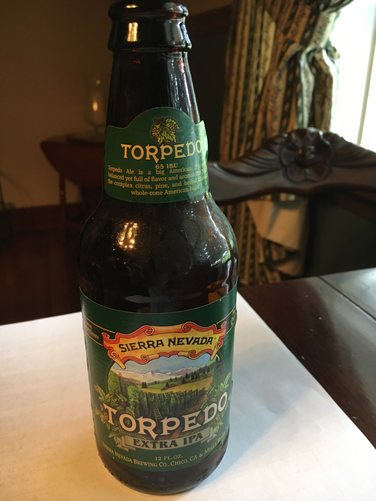
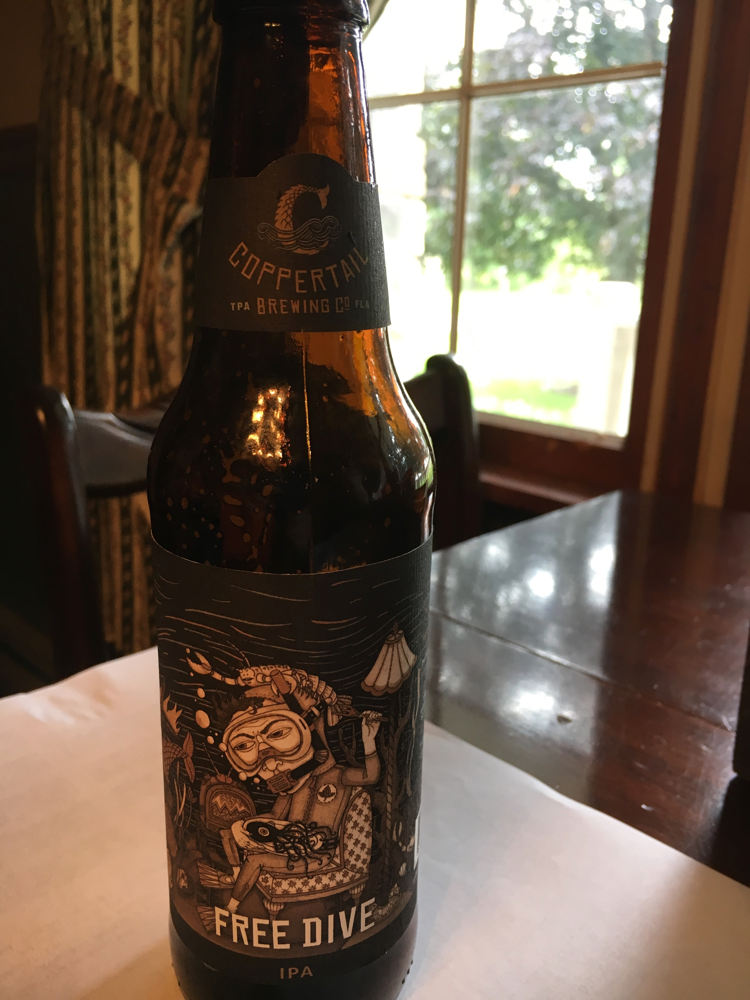
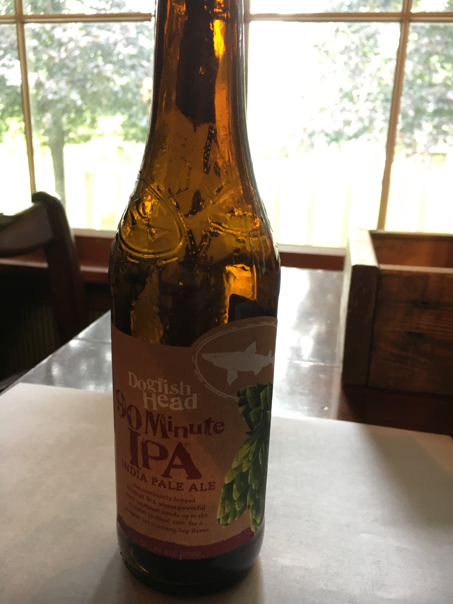
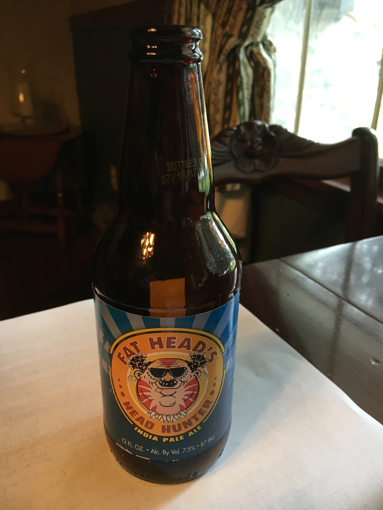
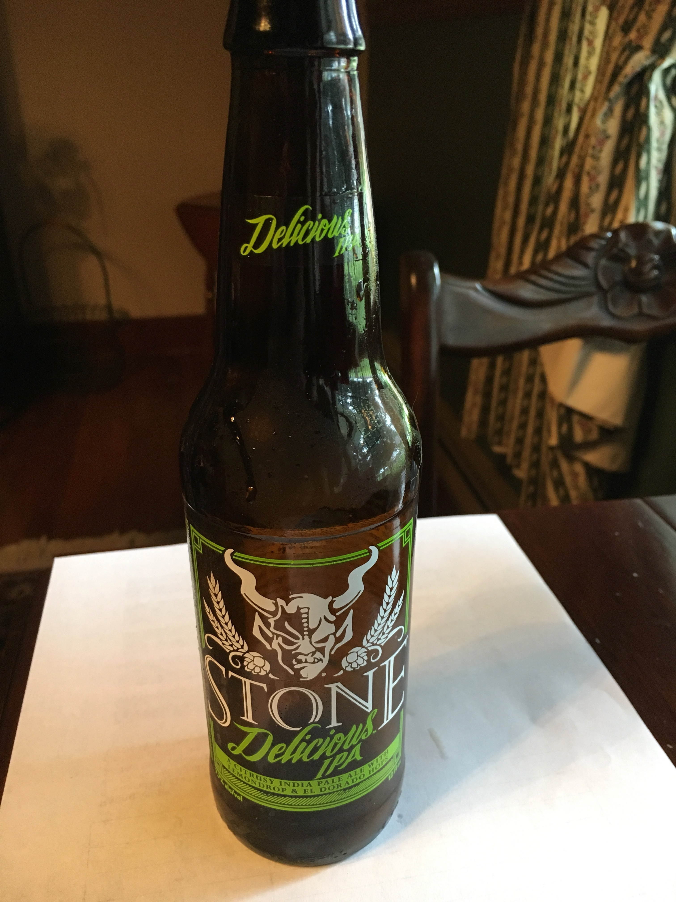
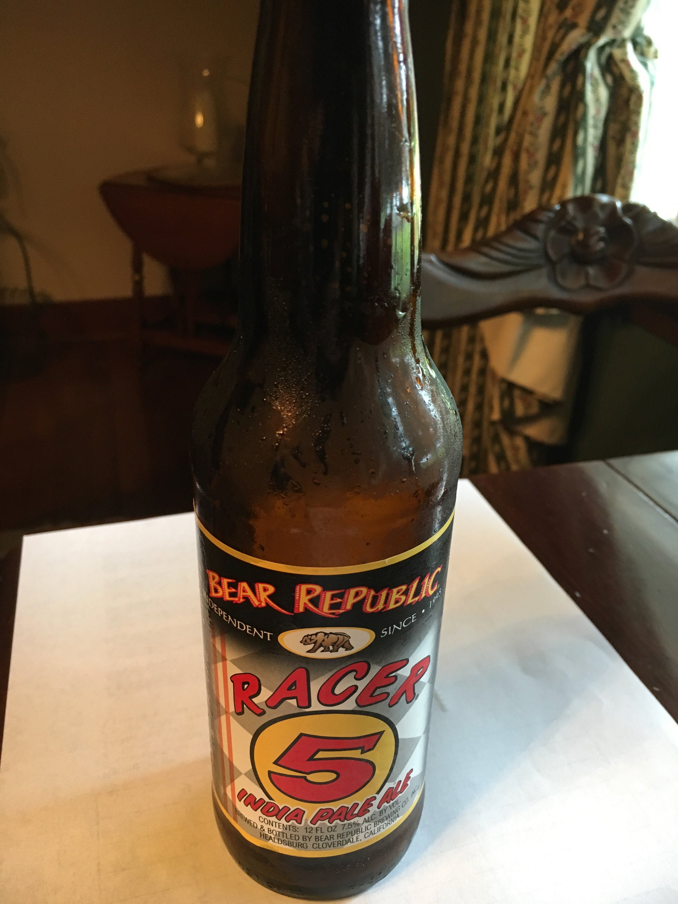
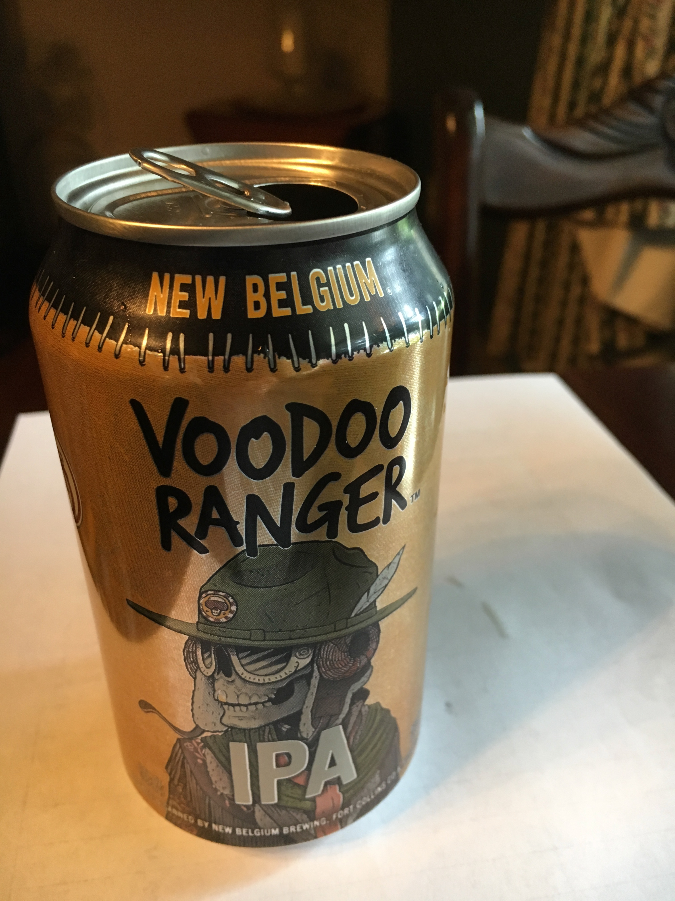

**Date:** Saturday, September 2, 2017

**Weather:** 63°, Cloudy, Rain

**Participants (9):** Aly, Andy, Bruce, Chris, Dean, Frank, JeffK, JeffS, Justin

| Beer Name  | Score (Rank) | Aly | Andy | Bruce | Chris | Dean | Frank | JeffK | JeffS | Justin |
|---|---|---|---|---|---|---|---|---|---|---|
|  Bell's Two Hearted Ale | 34 - #T1 | 4 | 4 | 3 | 4 | 3 | 4 | 4 | 4 | 4 |
|  Firestone Walker Union Jack IPA | 34 - #T1 | 4.5 | 4 | 3 | 4 | 4 | 4 | 4 | 3.5 | 3 |
|  Sierra Nevada Torpedo | 30.5 - #3 | 2 | 4 | 4 | 4 | 4 | 2 | 3 | 2.5 | 5 |
|  Coppertail Free Dive IPA | 30 - #T4 | 4.5 | 4 | 2 | 4 | 3 | 2 | 5 | 2.5 | 3 |
|  Dogfish Head 90 Minute | 30 - #T4 | 3.5 | 4 | 3.5 | 4 | 2 | 5 | 1 | 3 | 4 |
|  Fat Head's Hop Juju | 29.5 - #T6 | 5 | 4 | 3.5 | 4 | 3 | 1 | 2 | 4 | 3 |
|  Stone Delicious IPA | 29.5 - #T6 | 4.5 | 4 | 3 | 4 | 3 | 2 | 3 | 2 | 4 |
|  Bear Republic Racer 5 | 29.5 - #T6 | 2.5 | 4 | 4 | 4 | 4 | 3 | 2 | 3 | 3 |
|  New Belgium Voodoo Ranger IPA | 27.5 - #9 | 5 | 4 | 2 | 4 | 2 | 1 | 5 | 1.5 | 3 | 
