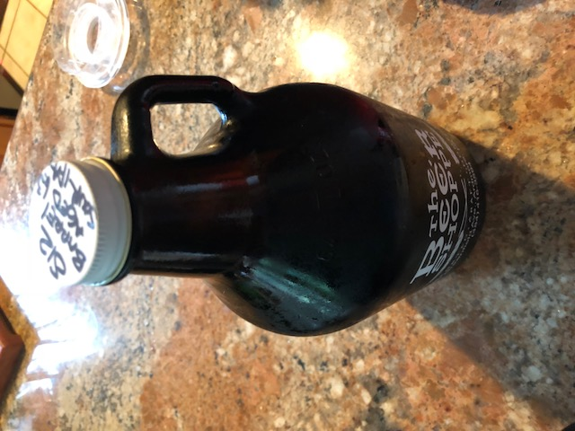

**Date:** Saturday, September 1, 2018

**Weather:** 75°, Overcast, No Rain

**Participants (9):** Alex, Aly, Bruce, Chris, Dean, Frank, JeffK, JeffS, Justin

| Beer Name  | Score (Rank) | Alex | Aly | Bruce | Chris | Dean | Frank | JeffK | JeffS | Justin |
|---|---|---|---|---|---|---|---|---|---|---|---|
|  Rec Room by Conshohocken Brewing Co Heaps of Green (Chris) | 36.5 #1 | 4 | 4 | 4 | 3 | 4 | 5 | 4.5 | 3 | 5 |
|  Iron Hill Philly Special (Bruce) | 33 - #2 | 3.5 | 3 | 3 | 4 | 4 | 4| 4 | 5 | 2.5 |
|  Rebel Hill Overslept IPA (JeffS) | 32 - #3 | 4.5 | 3 | 3 | 4.5 | 3 | 4 | 2 | 4 | 4 |
|  Root Down Drip (Justin) | 31 - #4 | 4.5 | 4 | 4 | 3.5 | 3 | 2 | 4 | 1 | 5 |
|  Crowded Castle Young Feneos (Frank) | 28.5 - #5 | 3 | 2 | 4 | 4 | 4 | 3 | 2.5 | 2 | 4 |
|  Stickman Brews Rate This Poorly (Dean) | 25.5 - #6 | 2.5 | 4 | 2 | 3.5 | 3 | 2 | 1.5 | 5 | 2 |
|  Sly Fox 113 (JeffK) | 24 - #7 | 2 | 2 | 4 | 2 | 4 | 3 | 3.5 | 1 | 2.5 |
|  Stable 12 naked in a barrel (Aly) | 20 #8 | 1 | 5 | 2 | 3 | 2 | 2 | 1 | 3 | 1 |
