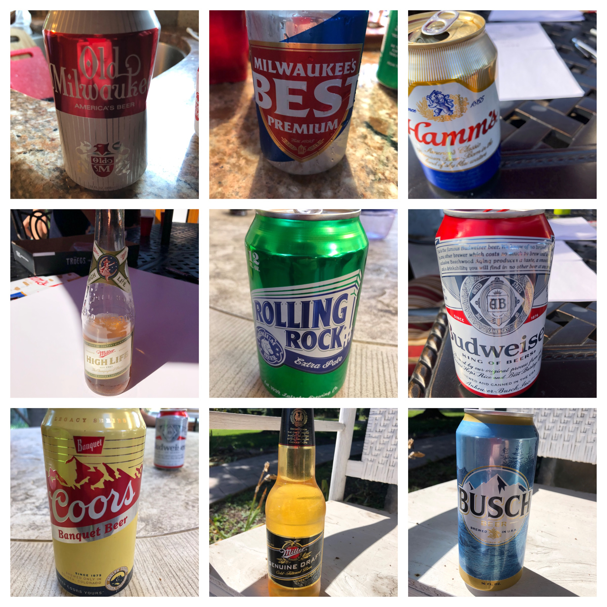

**Date:** Saturday, September 5, 2020

**Weather:** 80°, Sunny, No Rain, Super Nice Weather!

**Participants (9):** Alex, Aly, Bruce, Chris, Dean, Frank, JeffK, JeffS, Justin

|Beer Name|Score (Rank)|Alex|Andy|Bruce|Chris|Dean|Frank|JeffK|JeffS|Justin|
|---|---|---|---|---|---|---|---|---|---|---|
| Rolling Rock (Dean) | 31 (#1) | 3 | 5 | 4 | 4 | 3 | 3 | 3 | 2 | 4 |
|  Miller Genuine Draft (Andy/Aly) | 30 (#2) | 3 | 5 | 3 | 4 | 3 | 3 | 3 | 2 | 4 |
| Old Milwaukee (Frank) | 28.5 (#3) | 4 | 5 | 2.5 | 3 | 3 | 3 | 3 | 3 | 2 |
| Hamms (JeffS) | 28 | 3 | 5 | 3 | 3 | 3 | 3 | 3 | 2 | 3 |
| Budweiser (Justin) | 27.5 | 3 | 5 | 3.5 | 2 | 3 | 3 | 3 | 2 | 3 |
| Milwaukee's Best (Chris) | 27 | 3 | 5 | 3 | 2 | 3 | 3 | 3 | 2 | 3 |
| Coors Banquet (Bruce) | 26 | 2 | 5 | 3 | 3 | 3 | 3 | 3 | 2 | 2 |
|  Busch (JeffK) | 25.5 | 2 | 5 | 3.5 | 2 | 3 | 3 | 3 | 2 | 2 |
|  Miller High Life (Alex) | 25 | 4 | 5 | 3 | 1 | 3 | 3 | 3 | 1 | 2 |
