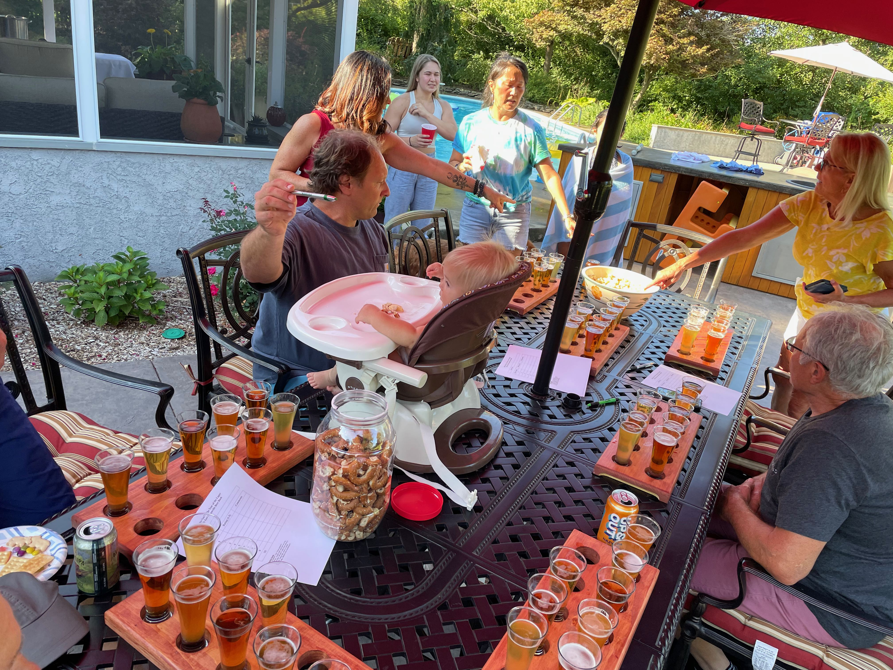
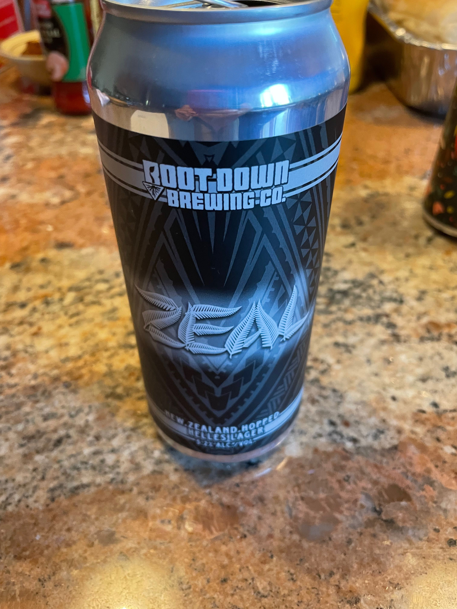
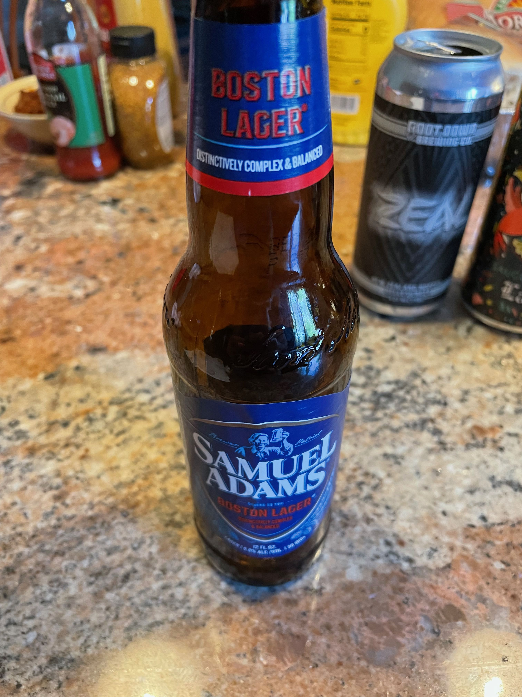
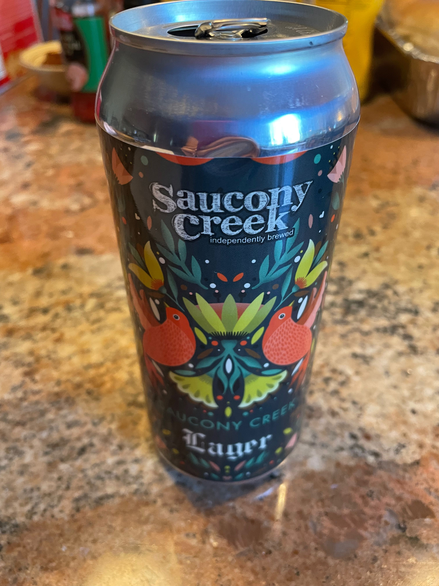

**Date:** Saturday, September 4, 2021

**Weather:** 75°, Sunny, No Rain

**Pool:** 75°

**Participants (8):** Andy/Aly, Bruce, Chris, Dean, Frank, JeffK, JeffS, Justin

|Beer Name| Score (Rank)|Andy/Aly|Bruce|Chris|Dean|Frank|JeffK|JeffS|Justin|
|---|---|---|---|---|---|---|---|---|---|
| Ballast Point Longfin (Chris) | 32 (#1T)   BEER OFF WINNER! 5-3 | 5 | 2 | 5 | 4 | 4 | 5 | 3 | 4 |	
| Funk Funktoberfest (Dean)	| 32 (#1T) | 4 | 4 | 4 | 5 | 4 | 4 | 4 | 3 |
| Simple Days (Bruce) | 29 (#3) | 3 | 4 | 5 | 4 | 4 | 4 | 2 | 3 |
| 2SP Delco Lager(Andy/Aly) | 28 (#4) | 3 | 4 | 3 | 3 | 4 | 5 | 3 | 3 |
| Cape May Tan Limes (JeffK) | 27 (#5) | 5 | 2 | 4 | 3 | 3 | 5 | 1 | 4 |
| Root Down Zeal(JeffS) | 26 (#6) | 3 | 3 | 2 | 3 | 5 | 5 | 2 | 3 |
| Samuel Adams Boston Lager (Justin) | 25 (#7) | 3 | 4 | 3 | 3 | 3 | 4 | 2 | 3 |
| Saucony Creek Lager (Frank) | 24 (#8) | 2 | 3 | 4 | 3 | 3 | 4 | 2 | 3 |