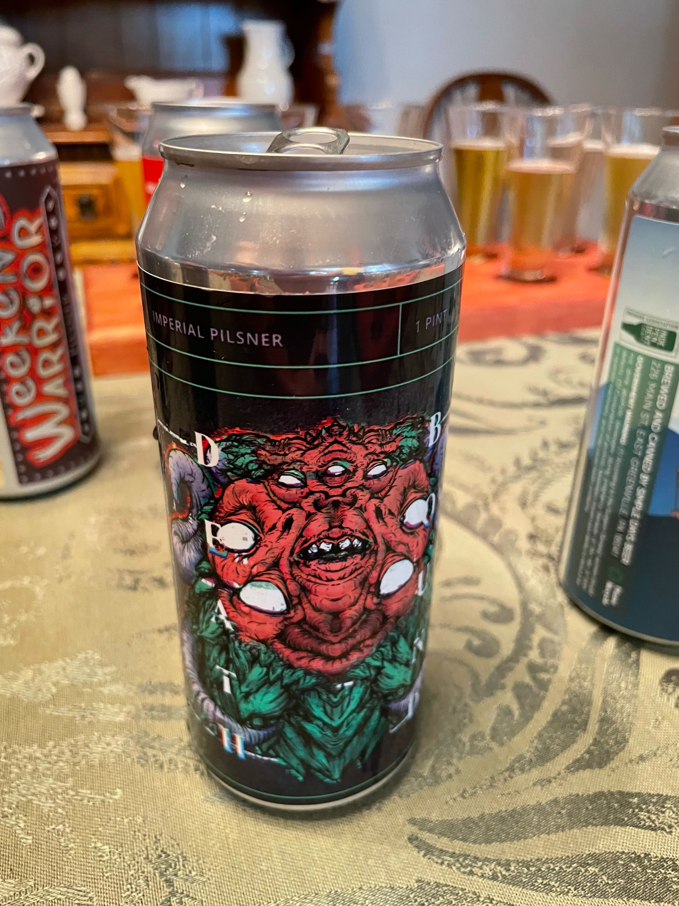
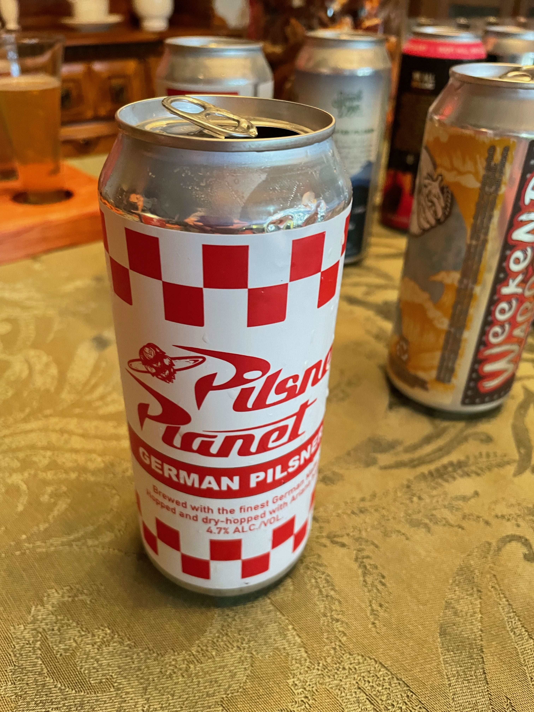
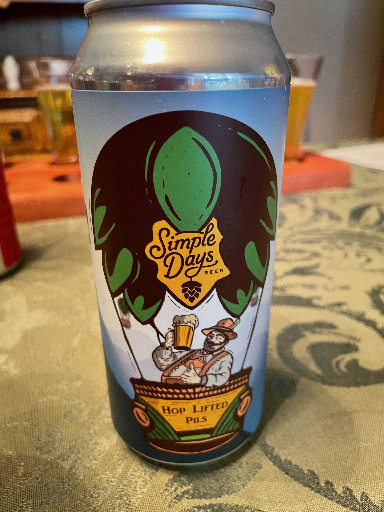
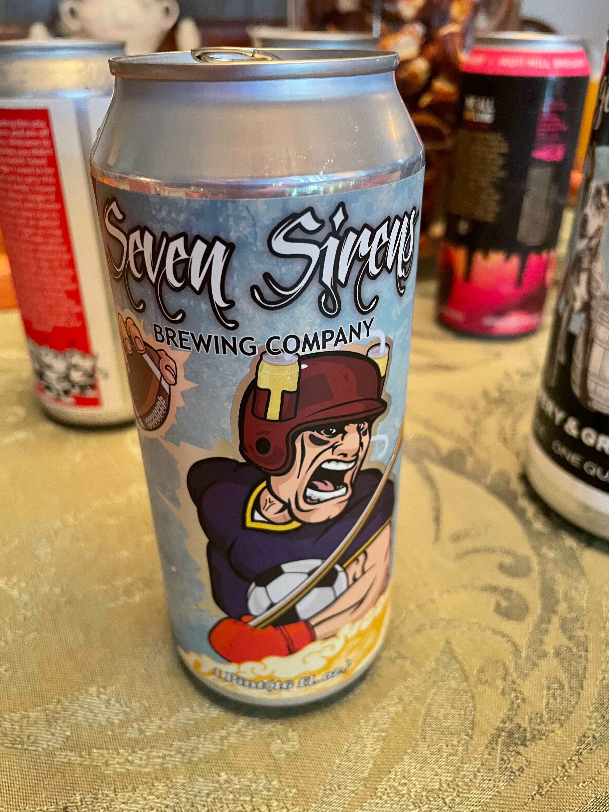
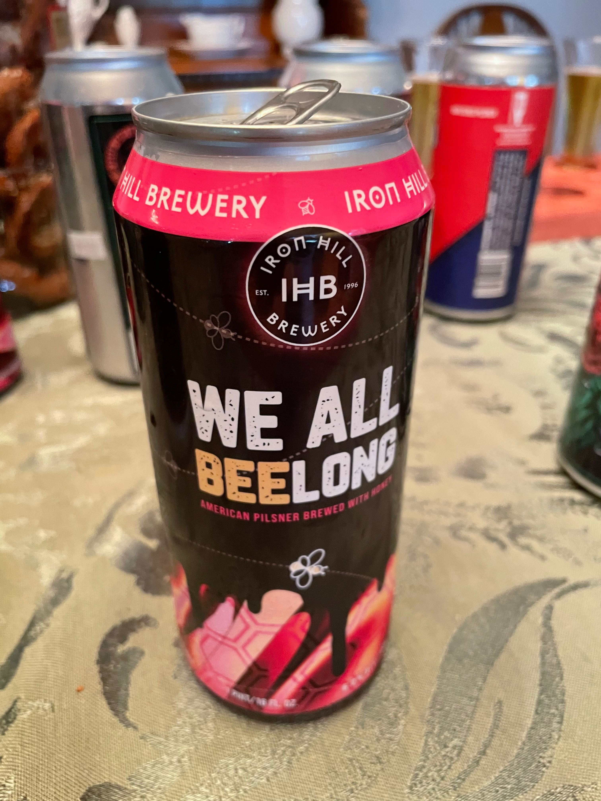
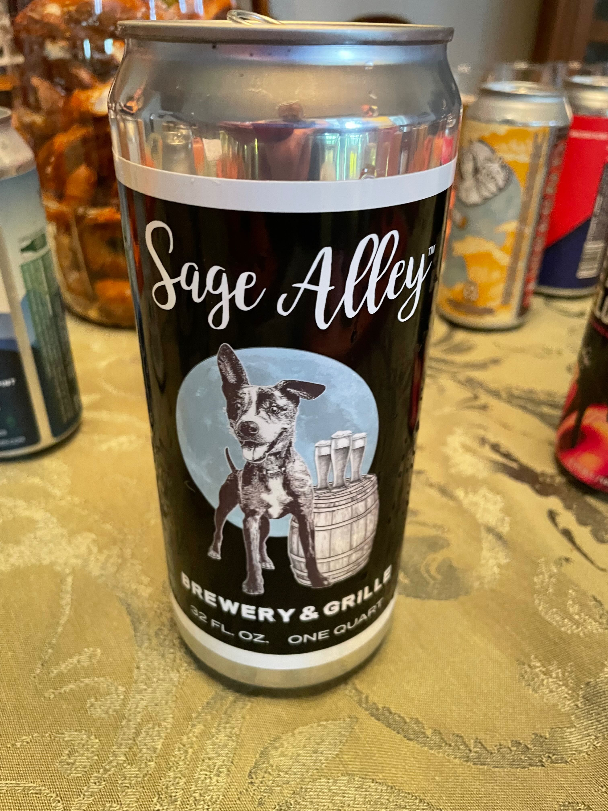

**Date:** Saturday, August 27, 2022

**Weather:** 84°, Overcast / Partially Sunny, Humid, No Rain

**Pool:** 79°

**Participants (7):** Bruce, Chris, Dean, Frank, JeffK, JeffS, Justin

|Beer Name| Score (Rank)|Bruce|Chris|Dean|Frank|JeffK|JeffS|Justin|
|---|---|---|---|---|---|---|---|---|
| Round Guys - Death Bound (Frank) | 23.5 (#1) | 5 | 4.5 | 4 | 2 | 4 | 1 | 3 |
| McCall Collective - Pilsner Planet (Justin)	| 23 (#2) | 4 | 4 | 3 | 2 | 5 | 3 | 2 |
| Simple Days - Hop Lifted Pils (Bruce) | 22 (#3T) | 4 | 3 | 2 | 3 | 4 | 3 | 3 |
| Seven Sirens - Weekend Warrior (Dean) | 22 (#3T) | 4 | 3 | 3 | 4 | 4 | 2 | 2 |
| Iron Hill - We All Beelong (JeffS) | 20.5 (#5) | 4 | 2.5 | 3 | 2 | 3 | 2 | 4 |
| Sage Alley (Chris) | 18.5 (#6) | 4 | 2.5 | 3 | 1 | 2 | 2 | 4 |
| Conshohocken - Ring the Bell (JeffK) | 17.5 (#7) | 4 | 2.5 | 2 | 2 | 3 | 2 | 2 |