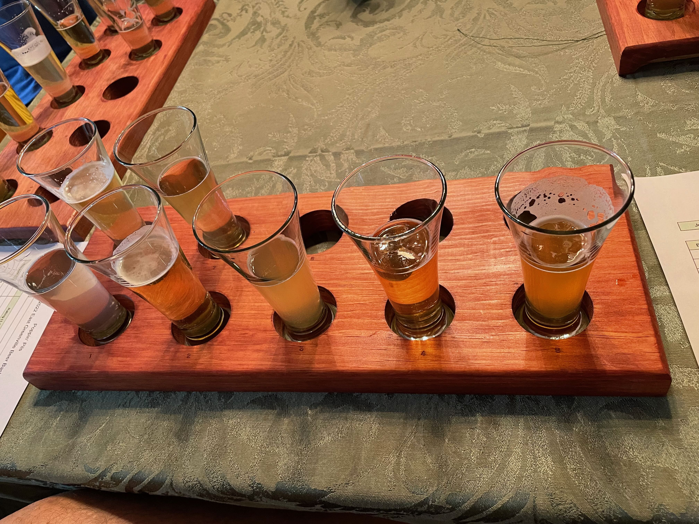
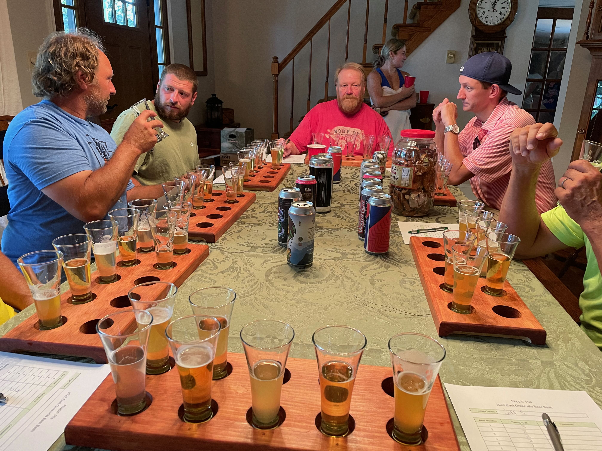
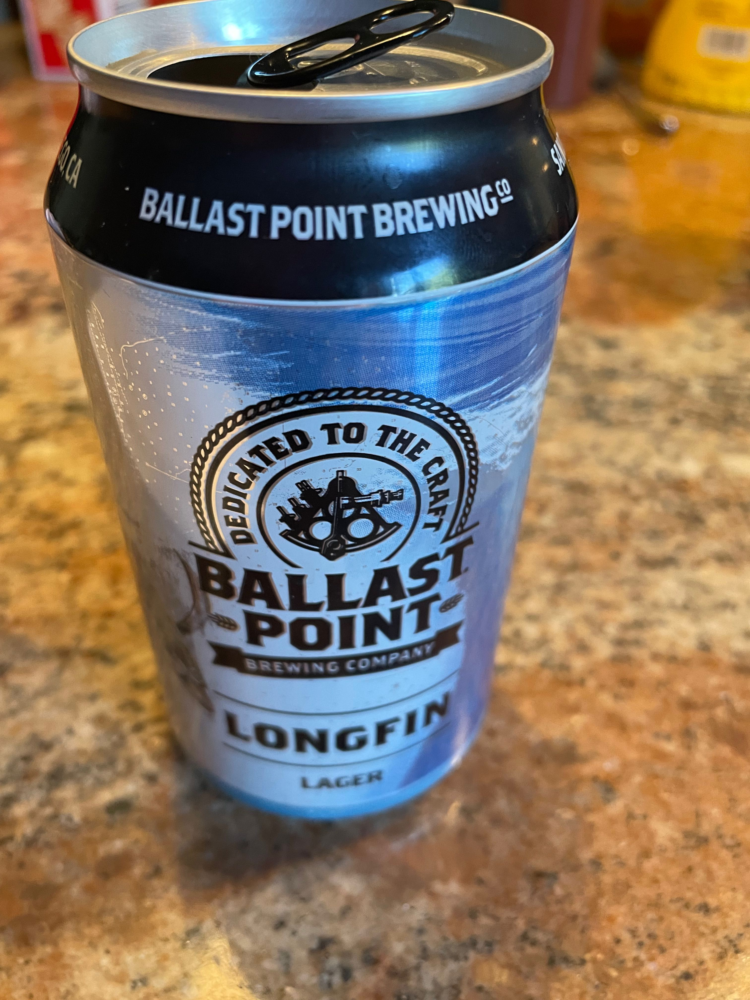
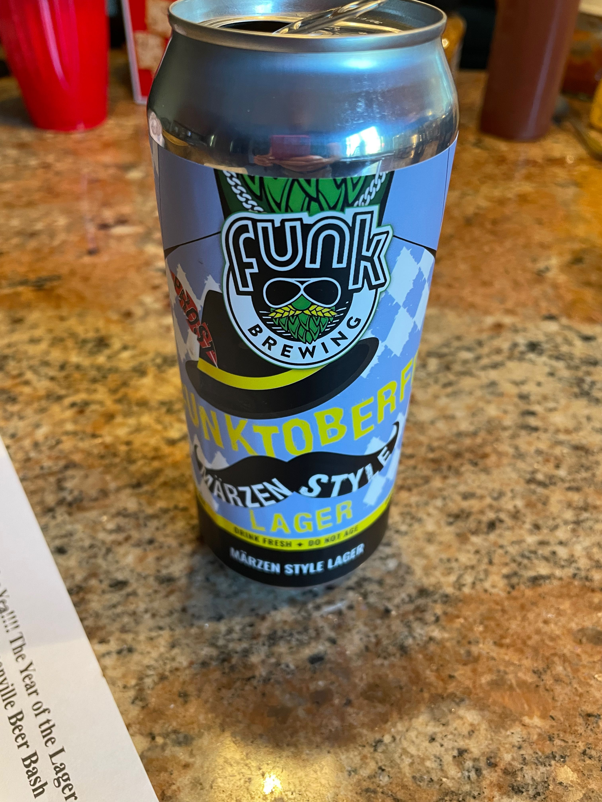
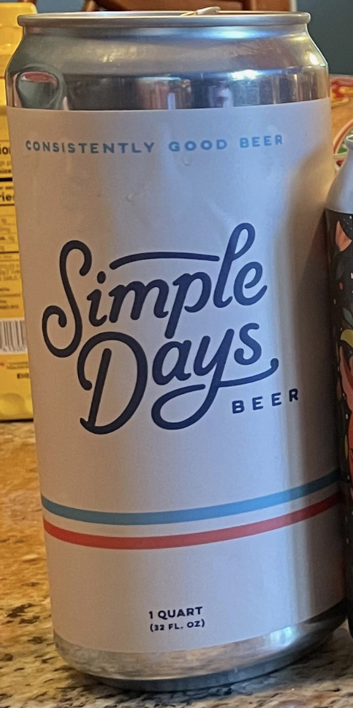
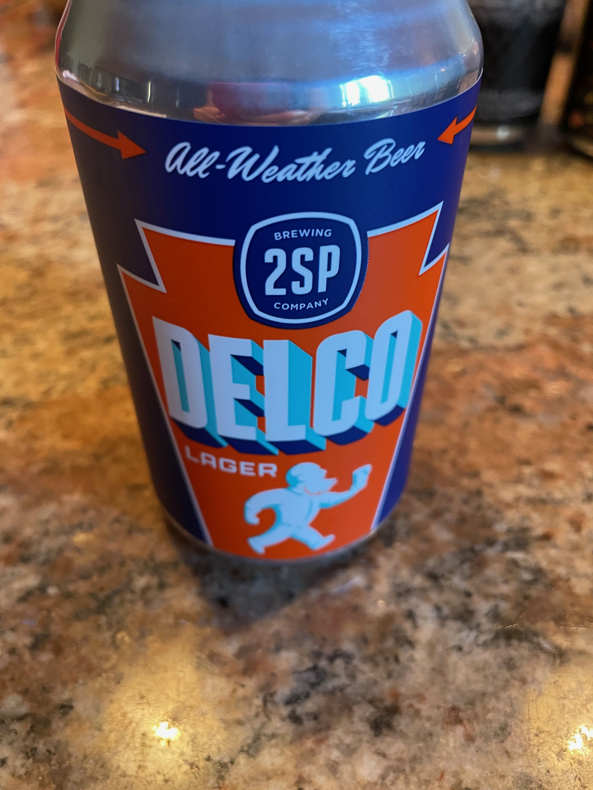
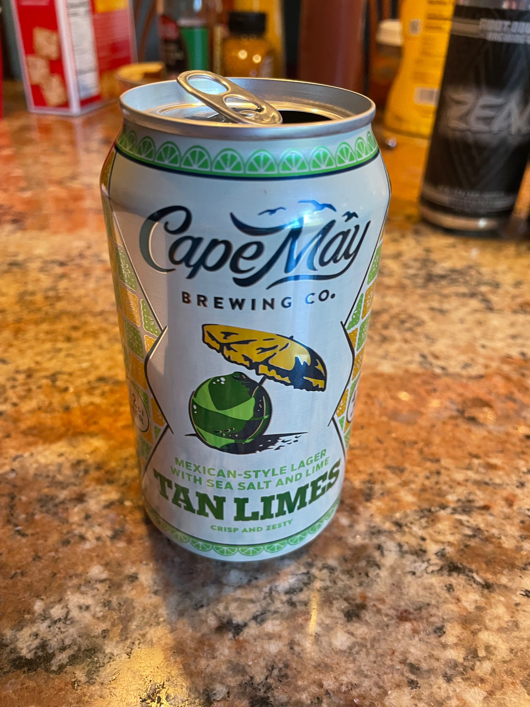
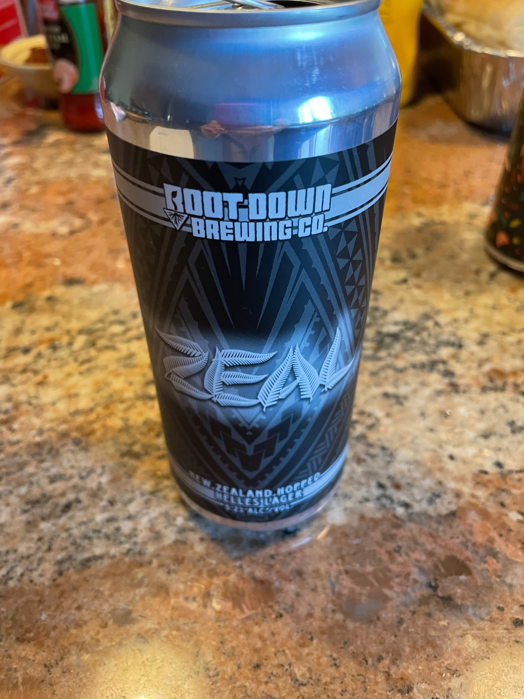
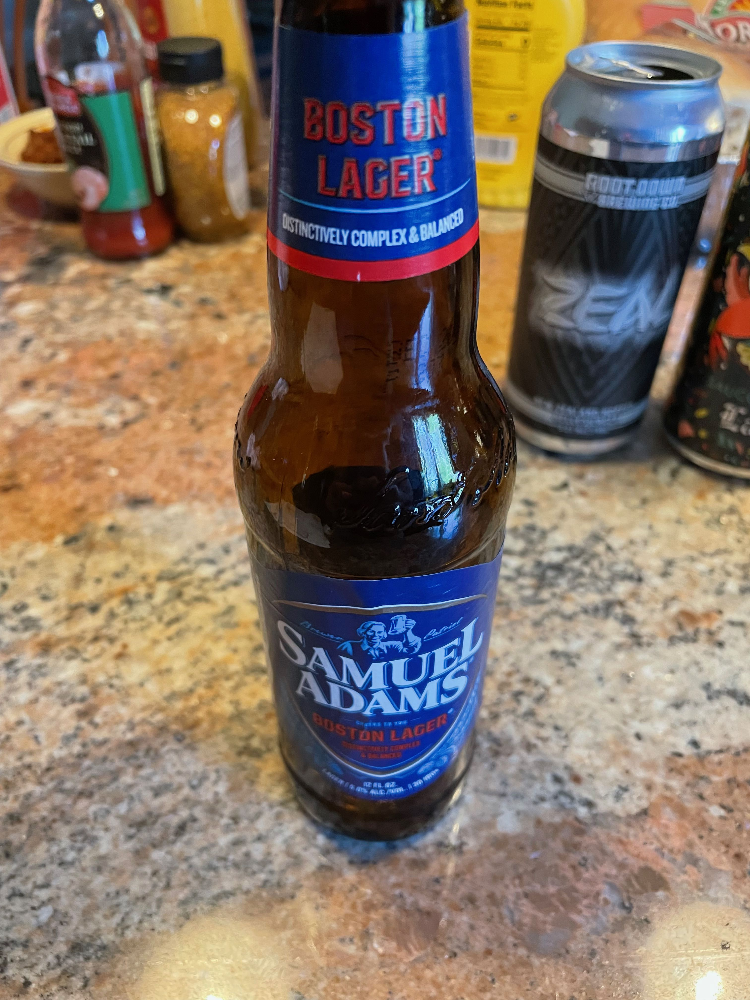
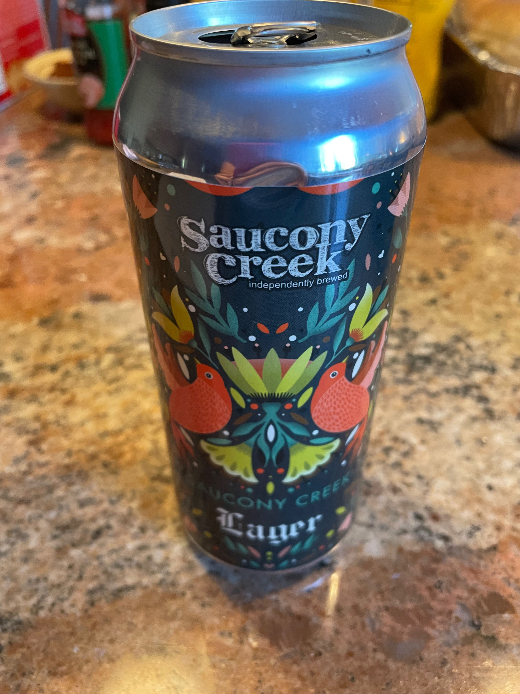

**Date:** Saturday, August 27, 2022

**Weather:** 84°, Overcast / Partially Sunny, Humid, No Rain

**Pool:** 79°

**Participants (7):** Bruce, Chris, Dean, Frank, JeffK, JeffS, Justin

|Beer Name| Score (Rank)|Bruce|Chris|Dean|Frank|JeffK|JeffS|Justin|
|---|---|---|---|---|---|---|---|---|
| XXBallast Point Longfin (Chris) | 32 (#1T) | 5 | 2 | 5 | 4 | 4 | 5 | 3 | 4 |	
| XXFunk Funktoberfest (Dean)	| 32 (#1T) | 4 | 4 | 4 | 5 | 4 | 4 | 4 | 3 |
| XXSimple Days (Bruce) | 29 (#3) | 3 | 4 | 5 | 4 | 4 | 4 | 2 | 3 |
| 2SP Delco XXLager(Andy/Aly) | 28 (#4) | 3 | 4 | 3 | 3 | 4 | 5 | 3 | 3 |
| Cape XXMay Tan Limes (JeffK) | 27 (#5) | 5 | 2 | 4 | 3 | 3 | 5 | 1 | 4 |
| Root XXDown Zeal(JeffS) | 26 (#6) | 3 | 3 | 2 | 3 | 5 | 5 | 2 | 3 |
| Samuel XXAdams Boston Lager (Justin) | 25 (#7) | 3 | 4 | 3 | 3 | 3 | 4 | 2 | 3 |
| Saucony XXCreek Lager (Frank) | 24 (#8) | 2 | 3 | 4 | 3 | 3 | 4 | 2 | 3 |