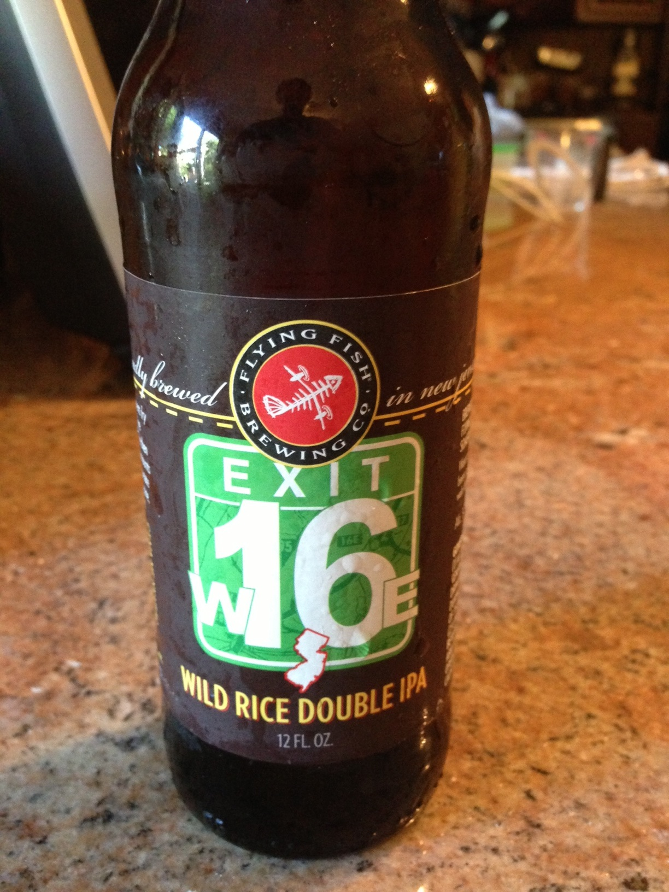

<h1 class="top-quote">
"Beer is proof that God loves us and wants us to be happy."
 
- Benjamin Franklin
</h1>

## 2017 - What's Up?

## 2016 - Beer Madness – German Region
## 2015 - (Un)Happy Anniversary
## 2014 - Year of the Can
## 2013 - Year of the IPA (East Coast)

**Date:** Saturday, August 24, 2013

**Participants (8):** Aly, Andy, Bruce, Chris, Dean, Frank, Jeff, Justin 

| Beer Name  | Score (Rank) | Aly | Andy | Bruce | Chris | Dean | Frank | Jeff | Justin |
|---|---|---|---|---|---|---|---|---|---|
|  Flying Fish Exit 16 (Andy) | 31.5 - #1 | 5 | 5 | 5 | 3 | 5 | 1 | 3.5 | 3 |
|  Three Heads Brewing - The Kind (Chris) | 24.5 - #2 | 4.5 | 4 | 2 | 3 | 4 | 3 | 3 | 1 |
|  Oskar Blues- Deviant Dale's IPA (Aly) | 23.5 - #3 | 3.5 | 4 | 3 | 3.5 | 5 | 1 | 2.5 | 1 |
|  Terrapin - Hopsecutioner (Jeff) | 21.5 - #4 | 4 | 3 | 2 | 3 | 4 | 2 | 1.5 | 2 |
|  Shipyard - Monkey Fist IPA (Bruce) | 21.0 - #5 | 1.5 | 4.5 | 1 | 3 | 3 | 2 | 3 | 3 |
|  Fegley's BrewWorks - Hop'solutely (Justin) | 19.5 - #6 | 2 | 1 | 4 | 5 | 1 | 1 | 2.5 | 3 |
|  Barrel Trolley - IPA (Frank) | 19 - #T7 | 2 | 3 | 2 | 4 | 3 | 1 | 3 | 1 |
|  Green Man - IPA (Dean) | 19 - #T7 | 3 | 1 | 1 | 3 | 3 | 3 | 3 | 2 |

## 2012 - Year of the Porter

**Date:** Sunday, September 2, 2012

**Participants (7):** Aly, Andy, Bruce, Chris, Dean, Frank, Jeff

**Candidates (1):** Justin ([Porter Presentation](./assets/porter.pdf))

**Resources:** [Beer Infographic](http://sposetti.github.io/East-Greenville/images/beer-infographic.jpg),
[Porter Beer - Wikipedia](http://en.wikipedia.org/wiki/Porter_beer)

| Beer Name  | Score (Rank) | Aly | Andy | Bruce | Chris | Dean | Frank | Jeff |
|---|---|---|---|---|---|---|---|---|
|  Saranac High Peaks Chocolate Orange (Aly) | 27 - #1 | 4 | 3 | 4 | 4 | 4 | 4 | 4 |
|  Stone Smoked Porter w/Vanilla Bean (Andy) | 23.5 - #2 | 5 | 5 | 3 | 3 | 2 | 3 | 2.5 |
|  Fuller's London Porter (Bruce) | 21.5 - #3 | 3 | 4.5 | 1 | 3.5 | 3 | 3 | 3.5 |
|  Deschutes Black Butte (Jeff) | 17.5 - #4 | 1 | 3.5 | 1 | 3 | 3 | 3 | 3 |
|  Otter Creek Stovepipe Porter (Dean) | 15.5 - #5 | 1.5 | 1 | 2 | 3 | 2 | 2 | 4 |
|  Sam Smith Taddy Porter (Chris) | 14 - #T6 | 1 | 2 | 2 | 4 | 1 | 2 | 3 |
|  Crown Valley Brewing Plowboy Porter (Frank) | 14 - #T6 | 2 | 4 | 1 | 1 | 3 | 1 | 2 |

## 2011 - Year of the Hefe "Wheat" Beer

**Date:** Sunday, September 4, 2011

**Participants (7):** Aly, Andy, Bruce, Chris, Dean, Frank, Jeff

[Wheat Beer - Wikipedia](http://en.wikipedia.org/wiki/Wheat_beer)

## 2010 - Year of the Belgian-Style beer

**Date:** Saturday, September 4, 2010

**Participants (7):** Aly, Andy, Bruce, Chris, Dean, Frank, Jeff

[Beer in Belgium - Wikipedia](http://en.wikipedia.org/wiki/Belgian_beer)

[Quick and Dirty Guide to Belgian Beer](http://www.thekitchn.com/quick-and-dirty-guide-to-belgi-109466)

## 2009 - Year of the Comfort Beer

**Date:** Saturday, September 5, 2009

**Participants (7):** Aly, Andy, Bruce, Chris, Dean, Frank, Jeff 

## 2008 - Micro Brew Bonanza

No records.

## 2007 - World of Flavors

No records.

## 2006 - Impromptu Beer Tasting

No records. Same day of *Hamburg Hamburger* Festival.

## 2005 - Impromptu Beer Tasting

No records.
